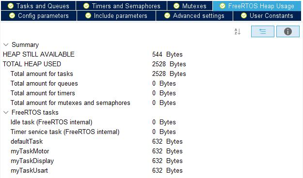

# stm32driver
stm32底盘电机驱动  
- 嵌入式实验室版本+L298N  

## 一、功能
- 1、搭载FreeRTOS
- 2、不定长数据接收（IDLE+DMA）
- 3、I2C显示屏（电机参数）
- 4、增量式PI控制器（直流编码电机）
## 二、整体架构
- IO布置  

- FreeRTOSHeapUsage  

- 功能性初始化  

- FreeRTOS运行时序  

## 三、应用外设
- SystemCore
    - RCC
    - SYS
- Timers
    - TIM2
    - TIM3
    - TIM4
- Connectivity
    - I2C1
    - USART3
- Middleware
    - FREERTOS
## 四、详细说明
### 1、FreeRTOS
- freertos.c 
只放出任务执行函数，其他内容请参考源码
```c
void StartDefaultTask(void *argument)
{
  /* USER CODE BEGIN StartDefaultTask */
  /* Infinite loop */
  for(;;)
  {
    osDelay(1);
  }
  /* USER CODE END StartDefaultTask */
}

void StartTaskMotor(void *argument)
{
  /* USER CODE BEGIN StartTaskMotor */
  para_init();
  /* Infinite loop */
  for(;;)
  {
// TODO
    osDelay(10);
  }
  /* USER CODE END StartTaskMotor */
}

void StartTaskDisplay(void *argument)
{
  /* USER CODE BEGIN StartTaskDisplay */
  /* Infinite loop */
  for(;;)
  {
    // TODO
    osDelay(50);
  }
  /* USER CODE END StartTaskDisplay */
}

void StartTaskUsart(void *argument)
{
  /* USER CODE BEGIN StartTaskUsart */
  /* Infinite loop */
  for(;;)
  {
    // TODO
    osDelay(1);
  }
  /* USER CODE END StartTaskUsart */
}
```
### 2、不定长数据接收
- usart.c
```c
/* USER CODE BEGIN 0 */
#if 1
struct __FILE{
    int handle;
};
FILE __stdout;
//定义_sys_exit()以避免使用半主机模式
void _sys_exit(int x){
  x = x;
}
//重定义fputc函数
int fputc(int ch, FILE *f){
  while((USART3->SR&0X40)==0);  // 循环发送,直到发送完成
  USART3->DR=(uint8_t)ch;
  return ch;
}
#endif
volatile uint8_t rx_len = 0;  // 接收数据的长度
volatile uint8_t rec_end_flag = 0;  // 数据接收完成标记
uint8_t rx_buffer[BUFFER_SIZE] = {0};  // 接收数据缓存数组
/* USER CODE END 0 */
```
```c
/* USER CODE BEGIN 1 */
void Usart_IDLE(void) {  //USART的IDLE接收
  uint32_t tmp_flag = 0;
  uint32_t temp;
  tmp_flag = __HAL_UART_GET_FLAG(&huart3, UART_FLAG_IDLE);  // 获取IDLE标志
  if((tmp_flag != RESET)){  // idle标志
    __HAL_UART_CLEAR_IDLEFLAG(&huart3);  // 清除标志位
    HAL_UART_DMAStop(&huart3);  // 停止DMA传输
    temp  =  __HAL_DMA_GET_COUNTER(&hdma_usart3_rx);  // 获取DMA中未传输的数据个数
    rx_len =  BUFFER_SIZE - temp;  // 总计数减去未传输的数据个数，得到已经接收的数据个数
    rec_end_flag = 1;  // 接受完成标志位置1
  }
}
void DMA_Usart_Send(uint8_t *buf,uint8_t len) {  // 串口发送封装
  if(HAL_UART_Transmit_DMA(&huart3,buf,len) != HAL_OK) {  // 判断是否发送正常，如果出现异常则进入异常中断函数
    Error_Handler();
  }
}
/* USER CODE END 1 */
```
- usart.h
```c
/* USER CODE BEGIN Prototypes */
extern volatile uint8_t rx_len;  // 接收数据的长度
extern volatile uint8_t rec_end_flag; // 数据接收完成标志
extern uint8_t rx_buffer[BUFFER_SIZE];  // 接收数据缓存数组
void DMA_Usart_Send(uint8_t *buf,uint8_t len);  // 串口发送封装
void Usart_IDLE(void);
/* USER CODE END Prototypes */
```
- stm32f1xx_it.c
```c
/* USER CODE BEGIN Includes */
#include "usart.h"
/* USER CODE END Includes */
```
```c
/* USER CODE BEGIN USART3_IRQn 0 */
Usart_IDLE();
/* USER CODE END USART3_IRQn 0 */
```
- main.c
```c
/* USER CODE BEGIN 2 */
  // Start usart3
  __HAL_UART_ENABLE_IT(&huart3, UART_IT_IDLE);
  HAL_UART_Receive_DMA(&huart3,rx_buffer,BUFFER_SIZE);
  /* USER CODE END 2 */
```
- freertos.c
```c
/* USER CODE BEGIN Header_StartTaskUsart */
/**
* @brief Function implementing the myTaskUsart thread.
* @param argument: Not used
* @retval None
*/
/* USER CODE END Header_StartTaskUsart */
void StartTaskUsart(void *argument)
{
  /* USER CODE BEGIN StartTaskUsart */
  /* Infinite loop */
  for(;;)
  {
    if(rec_end_flag) {  //判断是否完成接收
      HAL_GPIO_TogglePin(LED_GPIO_Port, LED_Pin);  // DEBUG
      Usart_Handle();
    }
    osDelay(1);
  }
  /* USER CODE END StartTaskUsart */
}
```
```c
void Usart_Handle() {  // USART处理函数
  user_API(rx_buffer, rx_len);  // 对数据进行分析

  rx_len = 0;  // 清除计数
  rec_end_flag = 0;  // 清除接收结束标志
  memset(rx_buffer,0,rx_len);
  HAL_UART_Receive_DMA(&huart3,rx_buffer,BUFFER_SIZE);  // 重新打开DMA接收
}
```
### 3、I2C显示屏
- 此部分已被封装为 `./Core/Src/User/oled*`
- freertos.c中的基本运行逻辑
```c
void OLED_flash_data(){
  show_info(motorInfo[0].ENC, 1+8*6, 0);
  show_info(motorInfo[0].ADD, 1+8*6, 1);
  show_info(motorInfo[0].TGT, 1+8*6, 2);
  show_info(motorInfo[0].PWM, 1+8*6, 3);
  show_info(motorInfo[1].ENC, 1+8*6, 4);
  show_info(motorInfo[1].ADD, 1+8*6, 5);
  show_info(motorInfo[1].TGT, 1+8*6, 6);
  show_info(motorInfo[1].PWM, 1+8*6, 7);
}
```
### 4、增量式PI控制器
- 此部分已被封装为 `./Core/Src/User/motor*`
- freertos.c中的基本运行逻辑
```c
void StartTaskMotor(void *argument)
{
  /* USER CODE BEGIN StartTaskMotor */
  para_init();
  /* Infinite loop */
  for(;;)
  {
    check_ENC(&motorInfo[0], &motorInfo[1]);
//    plus_ADD(&motorInfo[0], &motorInfo[1]);
    incremental_PI_A(&motorInfo[0]);
    incremental_PI_B(&motorInfo[1]);
    range_PWM(&motorInfo[0], &motorInfo[1], 7000);
    set_PWM(&motorInfo[0], &motorInfo[1]);
    osDelay(10);
  }
  /* USER CODE END StartTaskMotor */
}
```
## 五、作为下位机使用
115200串口通讯格式`[x, y]`
- 两电机转速
